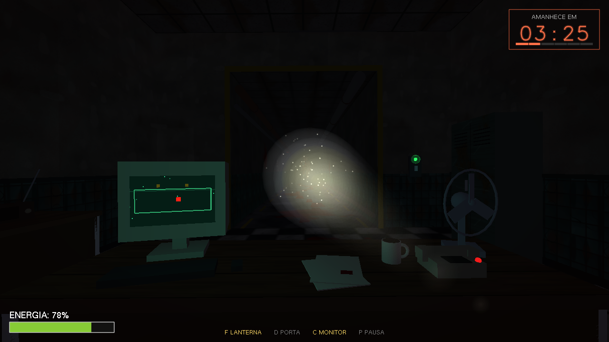
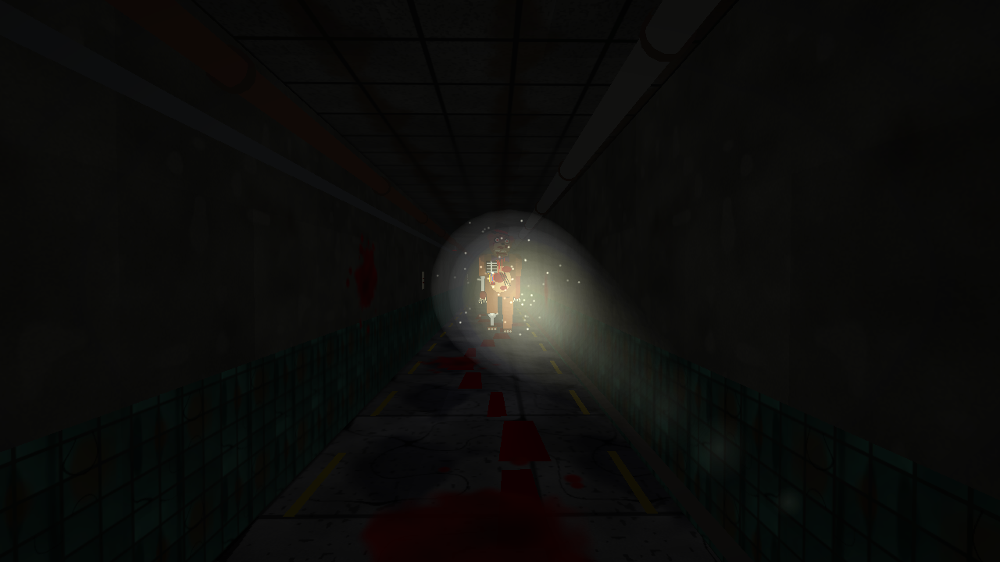
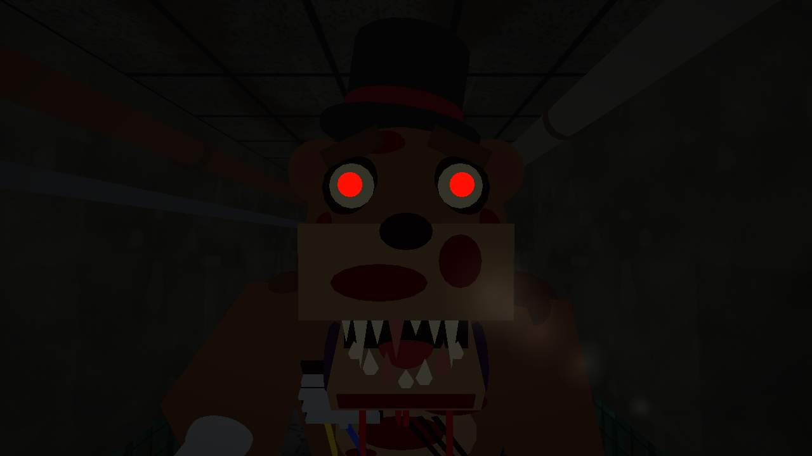
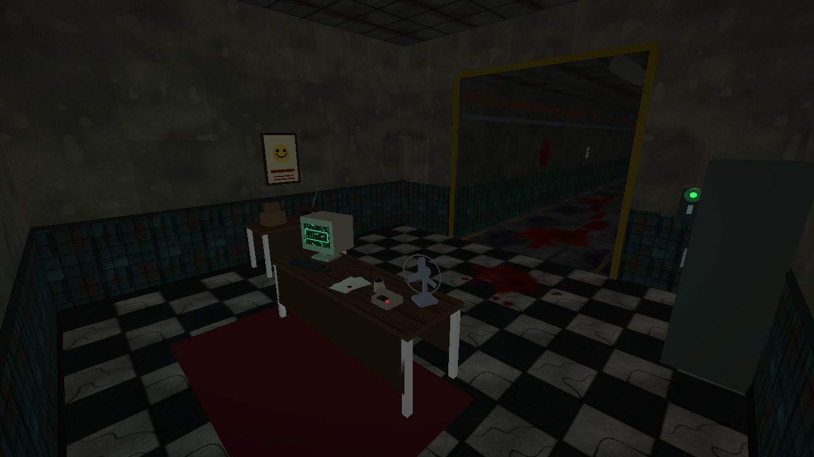
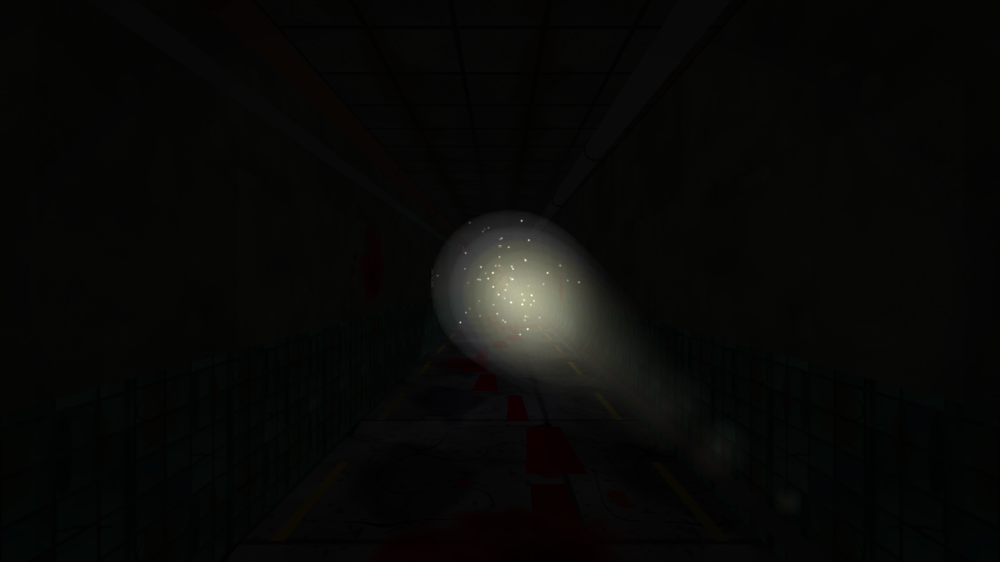
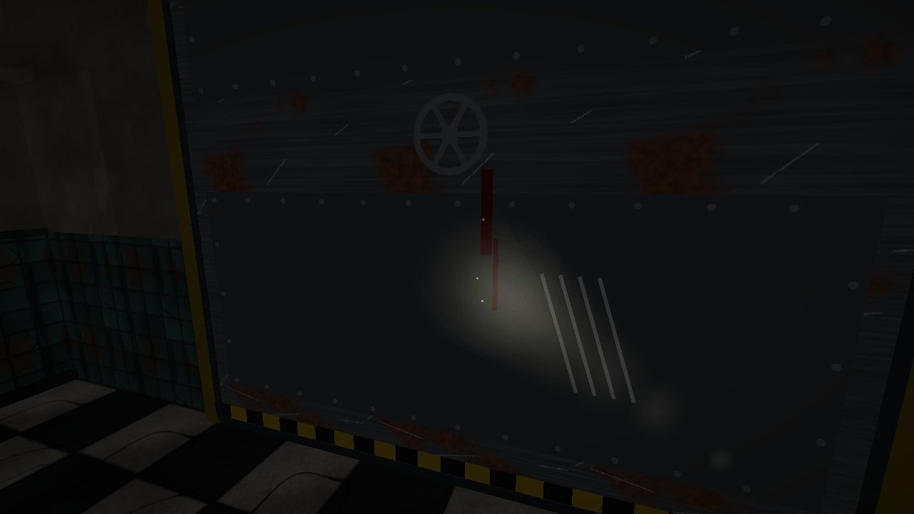
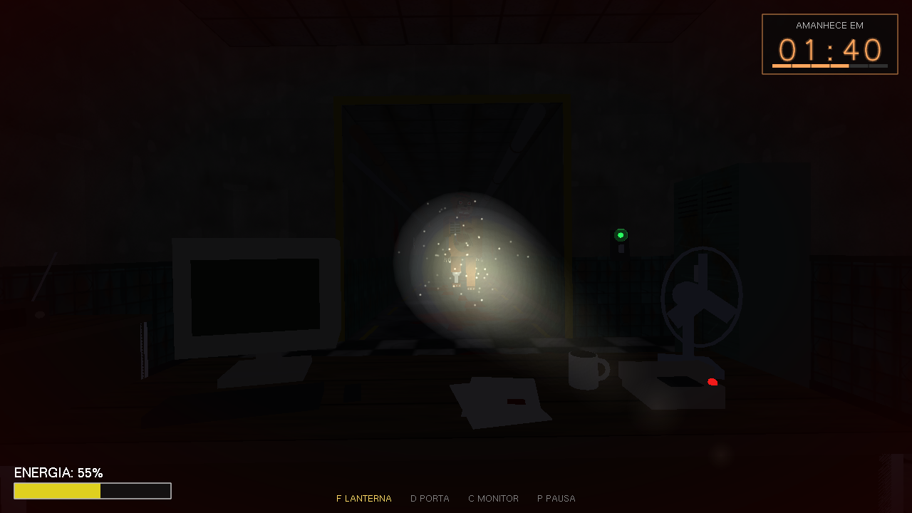
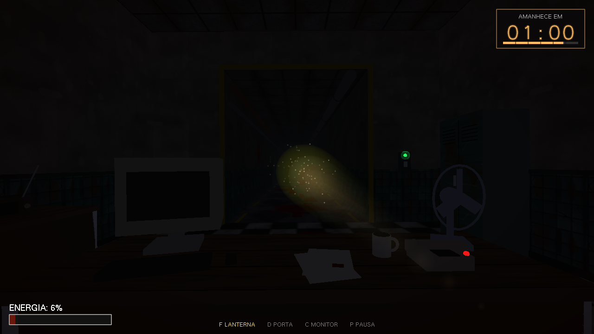

# 1 Noite no Frederico

Jogo de terror em primeira pessoa feito em C++ com OpenGL e GLUT.

Você é o vigia noturno de um prédio velho, sentado atrás de uma mesa numa saleta com uma abertura para o corredor, uma lanterna, um monitor e uma porta de emergência. Seu trabalho é simples: chegar às 6 da manhã. O problema é o Frederico, que passa a noite inteira vindo pelo corredor na sua direção.



## Como funciona

No escuro, o Frederico se aproxima. A lanterna só afasta ele se o **feixe estiver apontado para ele**: ligar a lanterna e olhar para o outro lado não adianta nada, e ainda gasta bateria. Mire, segure, e ele recua. Quando o feixe acerta, ele rosna e treme.

Ele também não é previsível. De tempos em tempos ele arranca numa corrida, e quanto mais a noite avança, mais rápido e mais frequente isso fica. Se ficar esperando ele chegar perto para reagir, provavelmente vai ser tarde demais.

A lanterna, a porta e o monitor dividem a mesma bateria, e ela não recarrega:

- **Lanterna:** gasta pouco, mas exige mira. Abaixo de 25% de bateria ela vai piorando: escurece, fica amarelada, o feixe encurta e estreita, e ela falha, piscando e apagando por instantes. Quando falha, não afasta o monstro.
- **Porta:** segura o Frederico do lado de fora, mas gasta energia muito mais rápido. É o botão de pânico, não uma solução.
- **Monitor:** mostra um mapa do corredor com um ponto vermelho onde o Frederico está, e as lâmpadas piscando de verdade. Quanto mais perto ele chega, mais chiado na tela e mais rápido o bipe. Gasta energia enquanto estiver ligado.

A noite dura 5 minutos reais. O relógio no canto superior direito mostra quanto falta para amanhecer, e um sino distante toca a cada hora. A barra no canto inferior esquerdo mostra a bateria. Do lado da porta tem um interruptor com um LED: verde quando ela está aberta, vermelho quando está fechada e apagado quando a energia acaba.

O jogo reage ao perigo. Quando o Frederico se aproxima, está em sprint ou a bateria está no fim, as bordas da tela escurecem e ficam vermelhas pulsando no ritmo de um coração, o granulado e a respiração da câmera aumentam, a névoa fecha, as lâmpadas do corredor falham mais e o batimento aparece no som.



## Controles

| Tecla | O que faz |
|---|---|
| Mouse | Olhar ao redor (e mirar a lanterna) |
| `F` | Liga e desliga a lanterna |
| `D` | Fecha e abre a porta |
| `C` | Liga e desliga o monitor |
| `P` ou `Esc` | Pausa |
| `R` | Recomeça, nas telas de game over e de vitória |
| `F12` | Tira uma captura de tela (pasta `capturas/`) |
| `F3` | Painel de depuração (posição do monstro, mira, sprint) |

Nos menus: setas ou `W`/`S` para escolher, `Enter` ou clique para confirmar.

O jogo usa fones ou caixas de som: o som é parte da jogabilidade. Os passos do Frederico mudam de lugar no estéreo conforme você vira a cabeça, ficam mais fortes quando ele chega perto e mais rápidos no sprint.

## Como rodar

**Linux (Ubuntu/Debian)**

```
sudo apt-get install build-essential freeglut3-dev
make
./frederico
```

**macOS**

O GLUT e o áudio já vêm no sistema. O Makefile detecta o macOS e ajusta o link sozinho.

```
make
./frederico
```

**Windows (MSYS2/MinGW)**

```
pacman -S mingw-w64-x86_64-gcc mingw-w64-x86_64-freeglut
mingw32-make
frederico.exe
```

A primeira compilação demora um pouco mais (uns 20 segundos) por causa da biblioteca de áudio. As seguintes só recompilam o que mudou.

**Sem som:** se não houver dispositivo de áudio, o jogo abre mudo e funciona normalmente. Para compilar sem a biblioteca de áudio, adicione `-DNO_AUDIO` aos flags de compilação.

## Capturas de tela













As imagens acima são geradas pelo próprio jogo. Para refazê-las (por exemplo, depois de mudar o cenário), rode na raiz do projeto:

```
./frederico --fotos
```

Ele monta 14 cenas (visão do jogador, corredor, monstro de corpo inteiro e de perto, sala, mesa, porta, susto, game over, menu, vitória, lanterna fraca e perigo alto), salva os PNGs em `docs/imagens/` e fecha sozinho.

## Arquivos

```
src/
  main.cpp           câmera, lanterna, mouse, teclado, menus, HUD, atmosfera, capturas e o laço do jogo
  scene_builder.*    sala, corredor, porta, interruptor, móveis, luzes e manchas de sangue
  enemy.*            o Frederico: modelo, animação e trajetória
  textures.*         texturas procedurais (piso, azulejo, concreto, metal, madeira, sangue...)
  audio.*            síntese de som e mixagem
  miniaudio.h        biblioteca de saída de áudio (domínio público)
  bezier.*           curva de Bézier que guia o monstro pelo corredor
  lighting.*         iluminação ambiente e a lanterna
Makefile
```

Tudo é gerado por código, sem arquivos de modelo, textura ou som. O cenário e o monstro são montados com primitivas do GLUT (cubos, esferas, cones, quads). As texturas são calculadas pixel a pixel a partir de ruído. Os sons são sintetizados (ondas, ruído, filtros e reverb), e a biblioteca miniaudio só leva o resultado até o alto-falante. Até o gravador de PNG das capturas é escrito à mão, com compressão própria.